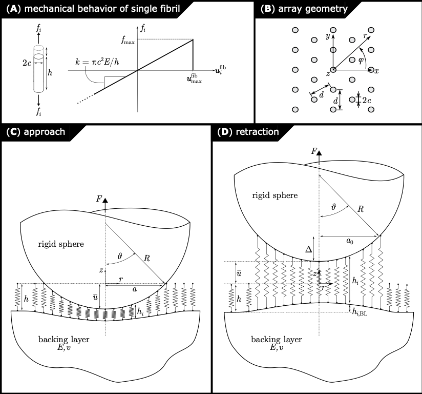

# Spherical Probe

The following code accompanies the paper, 'Breakdown of continuum models for spherical probe adhesion tests on micropatterned surfaces' by Simon Bettscheider, Dan Yu, Kimberly L. Foster, Robert M. McMeeking, Eduard Arzt, René Hensel, and Jamie A. Booth (In prep.) DOI: TBD. The figure below shows a schematic representation of components of the model.

The main script ('SphericalProbe_ExtractFibrilStrength.m') serves to extract a local measure of the adhesive strength of a fibrillar structure from a spherical probe adhesion test of a bioinspired micropatterned adhesive surface. It takes as its input the saturation pull-off force measured in experiment (see manuscript for details), the geometric properties of the fibril and array, and the material properties of the component material. It is valid for cylindrical vertically-oriented fibrils (independent of the tip-geometry) arranged in a hexangonal- or square-packed array, on a thick backing layer of the same component material. It outputs the fibril strain at detachment, the fibril detachment force, and the effective work of adhesion of the fibrillar interface. It should be ensured that the pull-off force is measured in the saturation regime with respect to preload, and that the array extends beyond the contact in this regime.

## Installation requirements

Execution of the code requires installation of [MATLAB](https://www.mathworks.com/products/matlab.html). Compatibility with all versions of MATLAB has not been tested.

## Set-up

All m-files contained in this repository should be downloaded and placed in the MATLAB working directory.

## Running

Execute the main script, 'SphericalProbe_ExtractFibrilStrength.m' in MATLAB. The inputs should be provided using a consistent system of units for length and force e.g. if dimensions are provided in mm and the pull-off force in mN, then the Young's modulus should be provided in mN/(mm^2). The outputs provided will be consistent with this set of units - strain on a fibril at detachment (emax) is dimensionless, the fibril detachment force has dimensions of force, and the effective work of adhesion has dimensions of force per unit length.

## Authors

Simon Bettscheider and Jamie A. Booth

## Contact

The corresponding author is Jamie Booth (jamie.booth at csun.edu).

## Acknowledgments

This model is based on that introduced by Noderer et al. (2007), Guidoni et al. (2010), and Bacca et al. (2016).

